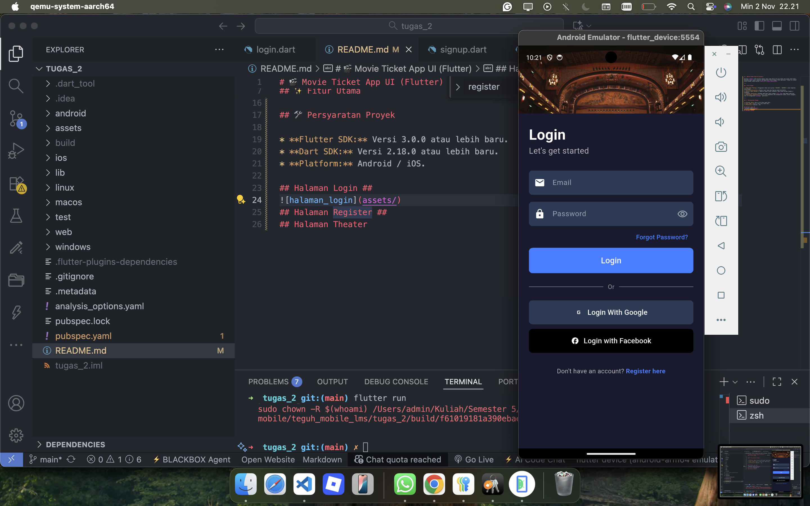
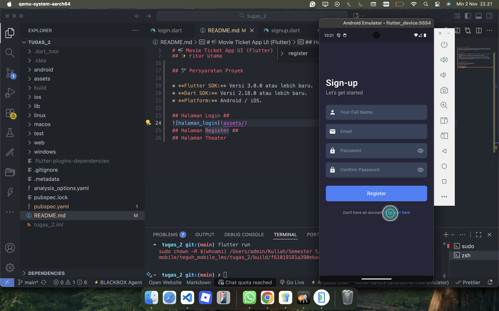
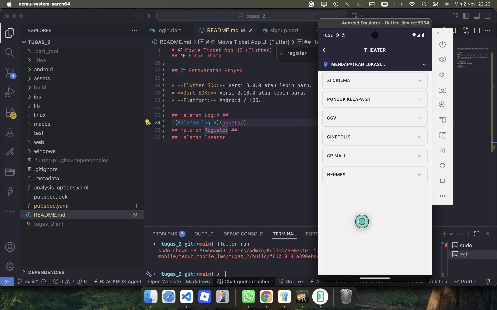

# 🎬 Movie Ticket App UI (Flutter)

Aplikasi *dummy* tiket bioskop dengan fokus pada desain UI yang modern dan gelap (dark mode), mencakup layar Login, Sign-up, dan pemilihan teater dengan fitur geolokasi. Proyek ini dibuat secara manual tanpa bantuan *tools* AI *visual generation*.

---

## ✨ Fitur Utama

* **Dark Mode Theming:** Penggunaan skema warna gelap (`#1A1A2E`, `#2E3B55`) untuk tampilan yang elegan.
* **Form Authentication:** Desain layar Login dan Sign-up yang terstruktur.
* **Social Login Mockup:** Tampilan tombol untuk integrasi login pihak ketiga (Google & Facebook).
* **Theater Selection:** Halaman pemilihan teater dengan *list view* yang dapat diperluas.
* **Geolocator Integration:** Fitur untuk mendeteksi dan menampilkan lokasi (kota) pengguna saat ini menggunakan *package* `geolocator`.

---

## 🛠️ Persyaratan Proyek

* **Flutter SDK:** Versi 3.0.0 atau lebih baru.
* **Dart SDK:** Versi 2.18.0 atau lebih baru.
* **Platform:** Android / iOS.

## Halaman Login ##

## Halaman Register ##

## Halaman Theater
